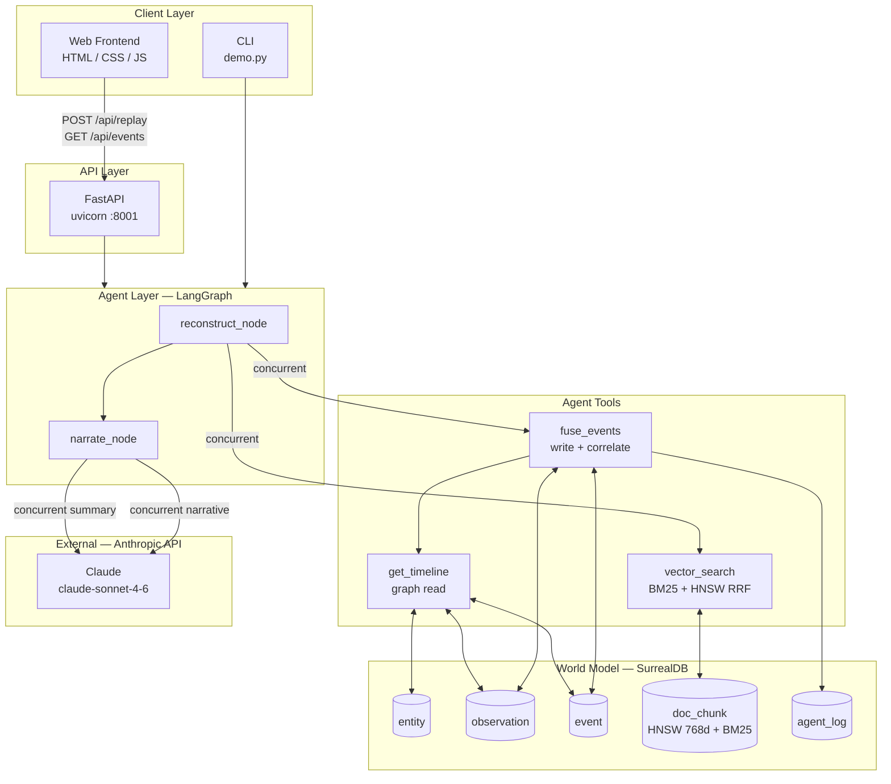
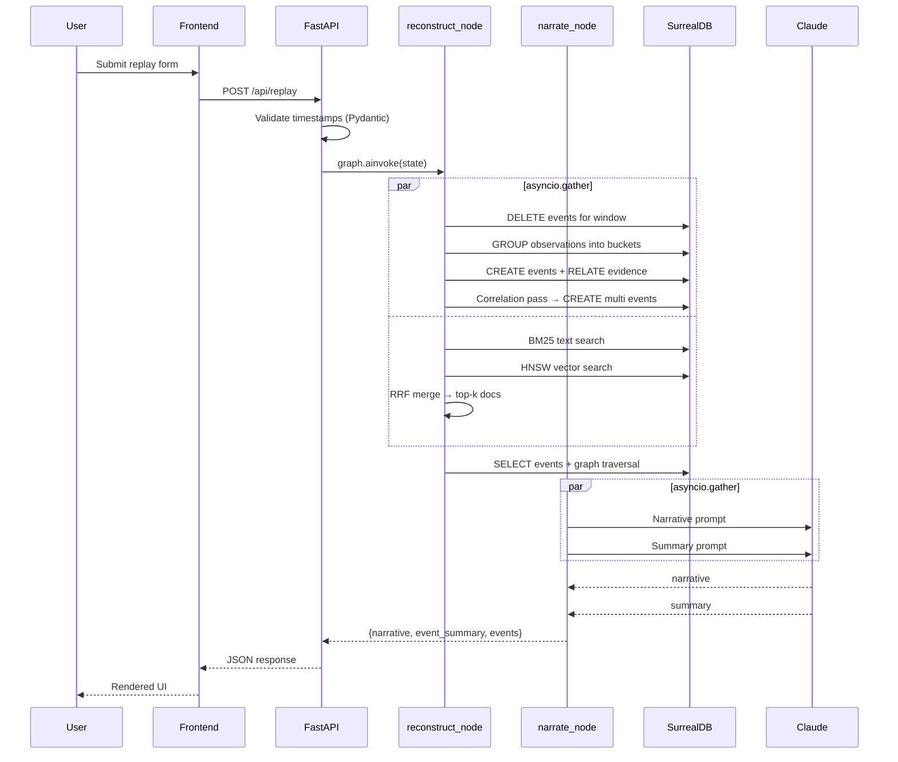
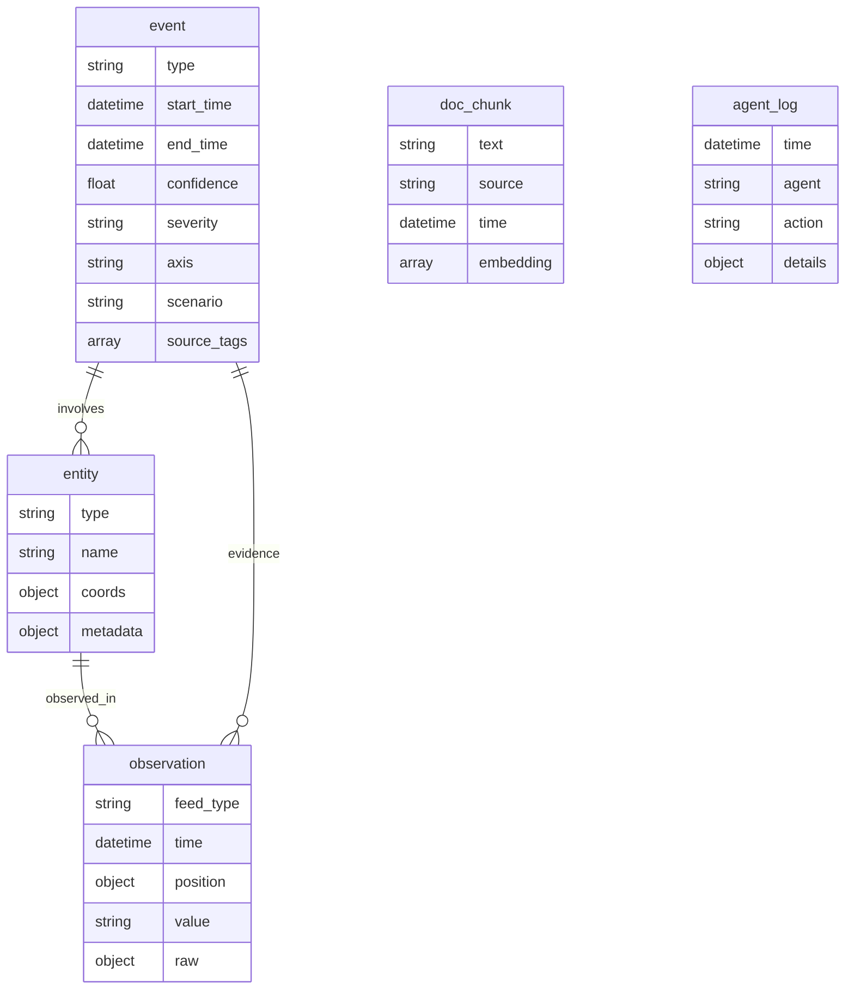

# System Architecture — GodEye

## Overview

GodEye is a time-resolved, multi-modal OSINT replay engine. It ingests heterogeneous sensor observations — ADS-B aircraft tracks, AIS vessel positions, GPS jamming detections, network events, and NOTAM-style documents — into a unified, persistent world model backed by SurrealDB. A LangGraph agent graph then orchestrates event fusion, graph traversal, hybrid document retrieval, and LLM-driven narration to answer "what happened in this time window?" with a structured, evidence-grounded response.

The central design principle is **world-model grounding**: rather than treating each query as an isolated RAG lookup, GodEye maintains a knowledge graph that persists across requests. Observations link to entities; events link to observations and entities; documents are indexed for both semantic and keyword retrieval. The LLM operates over this enriched, structured context — not raw text alone — and the architecture makes this distinction explicit by producing a parallel *baseline* path (RAG only) alongside the *structured* path (graph + RAG) for comparison.

---

## Key Requirements

**Functional**
- Ingest multi-modal time-stamped observations and fuse them into typed, confidence-scored events grouped by feed type and time bucket.
- Detect cross-feed correlations (≥2 feed types co-occurring in the same 10-minute window) and surface them as first-class events.
- Retrieve relevant documents via hybrid BM25 + vector search, merged with Reciprocal Rank Fusion.
- Generate a structured narrative and per-cluster event summary via a large language model.
- Expose a REST API (`POST /api/replay`, `GET /api/events`, `GET /health`) and a web frontend.
- Support scenario-scoped data isolation (multiple named scenarios in a single database).

**Non-functional**
- **Low end-to-end latency:** I/O-independent operations (fusion and vector search; narrative and summary) run concurrently via `asyncio.gather`.
- **Idempotency:** Re-running a replay for the same window produces the same result; existing events are deleted before re-fusion.
- **Graceful degradation:** Every DB operation, LLM call, and per-record action has individual error handling with structured fallback returns.
- **Local-first:** Embeddings run on-device via HuggingFace sentence-transformers; no embedding API key required.
- **Configurability:** SurrealDB endpoint and Anthropic API key are environment-variable-driven.

---

## High-Level Architecture

GodEye comprises four logical layers: a **static frontend**, a **FastAPI HTTP gateway**, a **LangGraph agent graph**, and a **SurrealDB world model**. The agent graph is the processing core; SurrealDB is the single source of truth for all data — graph relationships, vector embeddings, time-series observations, and agent audit logs.



*The two concurrent arrows out of `reconstruct_node` represent an `asyncio.gather` — fusion and vector retrieval run in parallel. The two concurrent arrows from `narrate_node` to Claude represent a second `asyncio.gather` — the narrative and summary LLM calls run in parallel. All persistent state lives in SurrealDB; Claude is the only external service dependency.*

---

## Component Details

### Web Frontend

**Responsibilities:** Render the replay UI; submit replay requests; display narrative, event summary, and events table.

**Technology:** Static HTML5, CSS3, vanilla JavaScript. No build step or framework dependency.

**Key behaviour:**
- Sends `POST /api/replay` on form submit; renders the JSON response using a pure-JS Markdown renderer (XSS-safe: HTML is escaped before pattern application).
- `AbortController` cancels in-flight requests if the user re-submits before a response arrives.
- Displays skeleton loaders during request, severity/axis badge components, and toast notifications.
- Communicates with the API exclusively over `http://localhost:8001`.

**Owns no data.** All state lives in SurrealDB or the LLM response.

---

### FastAPI Gateway (`api/replay/api.py`)

**Responsibilities:** Validate inbound HTTP requests; invoke the LangGraph graph; return structured responses. Expose health and events endpoints that bypass the LLM.

**Technology:** FastAPI, Uvicorn, Pydantic v2.

**Endpoints:**

| Method | Path | Description |
|---|---|---|
| `GET` | `/health` | Pings SurrealDB; returns `{"status":"ok","db":"connected"}` or HTTP 503 |
| `GET` | `/api/events` | Returns raw events from SurrealDB for a scenario/window without invoking the LLM |
| `POST` | `/api/replay` | Full replay pipeline: fusion → timeline → RAG → LLM narration |

**Validation:** `ReplayRequest` Pydantic model validates `from_time` and `to_time` as ISO 8601 via `field_validator`. Invalid inputs return HTTP 422 before the agent graph is invoked.

**CORS:** Permissive (`allow_origins=["*"]`) for local development. Restrict to known origins in production.

**Error surface:** All agent exceptions are caught and re-raised as `HTTPException`, never leaking stack traces to the client.

---

### LangGraph Agent Graph (`src/agents/graph.py`)

**Responsibilities:** Orchestrate the two-phase agent pipeline (reconstruct → narrate) using async LangGraph nodes. Manage concurrency within each phase.

**Technology:** LangGraph `StateGraph`, Python `asyncio`.

**Graph topology:**

```
reconstruct_node → narrate_node → END
```

**`reconstruct_node`**

Runs two operations concurrently via `asyncio.gather`:
1. `fuse_events` — deletes any pre-existing events for the window (idempotency), groups observations into typed events, detects cross-feed correlations, writes results to SurrealDB.
2. `vector_search` — embeds the user query and runs concurrent BM25 + HNSW retrieval merged via RRF.

After both complete, runs `get_timeline` sequentially (depends on fusion output) to load the enriched event graph (events + linked observations + entities).

**`narrate_node`**

Runs two LLM calls concurrently via `asyncio.gather`:
1. Main narrative — full structured-vs-baseline analysis using the event graph and RAG docs.
2. Event summary — per-cluster one-liners for the UI summary panel.

Both calls share the same `ChatAnthropic` instance (`claude-sonnet-4-6`). Prompts include a field glossary explaining `confidence` semantics and the `correlation` event type.

**State (`src/agents/state.py`):** Typed `TypedDict` carrying `mode`, `query`, `from_time`, `to_time`, `region`, `scenario`, `events`, `prev_events`, `context_docs`, `baseline_docs`, `event_summary`, `narrative`.

---

### Agent Tools (`src/agents/tools.py`)

Three LangChain `@tool`-decorated async functions, each managing its own SurrealDB connection lifecycle via `try/finally`.

#### `fuse_events`

1. Deletes existing events for the window (idempotency guarantee).
2. Groups observations by `(feed_type, floor(time, 10m))` in a single SurrealDB query.
3. For each group: calculates `confidence = min(1.0, obs_count / 5.0)` and severity tier; creates an `event` record; batch-links all observations via `evidence` edges in a single `FOR` loop query; resolves linked entities and creates `involves` edges.
4. Cross-feed correlation pass: for each 10-minute bucket with ≥2 distinct feed types, creates a `type=correlation`, `axis=multi`, `severity=high` event.
5. Logs start and end actions to `agent_log`.

#### `get_timeline`

Single graph-traversal query returning events with their linked observations and entities. Read-only; runs after `fuse_events` completes.

#### `vector_search`

Hybrid retrieval:
1. Embeds the query string via `all-mpnet-base-v2` (768-dim, local).
2. Concurrently issues BM25 (`text @@ $query`) and HNSW (`embedding <|k,COSINE|> $vec`) queries, each fetching `k×3` candidates.
3. Merges via RRF: `score = Σ 1/(60 + rank)` across both ranked lists; returns top-k.

---

### SurrealDB World Model

**Technology:** SurrealDB 3.x, namespace `god_eye`, database `world`.

**Node tables:**

| Table | Purpose |
|---|---|
| `entity` | Named assets (aircraft, vessels, infrastructure) with coordinates and metadata |
| `observation` | Raw sensor readings: feed type, timestamp, position, value, raw payload |
| `event` | Fused higher-level events: type, axis, severity, confidence, source tags, scenario, window |
| `doc_chunk` | Textual intelligence fragments with 768-dim embedding and BM25 full-text index |
| `agent_log` | Structured audit trail of agent actions |

**Edge tables:**

| Table | Semantics |
|---|---|
| `observed_in` | `entity → observation` — asset to sensor reading |
| `evidence` | `event → observation` — event to supporting observations |
| `involves` | `event → entity` — event to implicated entities |

**Indices:**

| Index | Type | Purpose |
|---|---|---|
| `doc_chunk_embedding` | HNSW, COSINE, 768d | Dense semantic vector search |
| `doc_chunk_fts` | BM25, `text_en` analyser (snowball/English) | Keyword full-text search |

---

### Embedding Model

**Technology:** `sentence-transformers/all-mpnet-base-v2` via `langchain_community.embeddings.HuggingFaceEmbeddings`.

**Specification:** 768 dimensions, 109M parameters, MTEB STS benchmark 69.6. Selected over `all-MiniLM-L6-v2` (384d, 63.3) for ~10% better retrieval quality; the inference latency difference (~50ms vs ~150ms on CPU) is negligible at ≤5 embeds per request.

**Lifecycle:** Loaded once at module import time as a module-level singleton. Not reloaded per request.

---

## Data Flow

### Replay Request



---

## Data Model



**Key relationships:**
- An `entity` produces many `observation` records linked by `observed_in` edges.
- An `event` is evidenced by one or more `observation` records via `evidence` edges.
- An `event` involves zero or more `entity` records via `involves` edges.
- `doc_chunk` records are standalone; retrieved by HNSW + BM25 index. Future work would add edges to `entity` for graph-anchored retrieval.

---

## Infrastructure & Deployment

### Local development

| Process | Command |
|---|---|
| SurrealDB | `surreal start --user root --pass root` |
| API server | `uvicorn api.replay.api:app --reload --port 8001` |
| Frontend | Open `frontend/index.html` in browser |
| Data loader | `python load_synthetic_world.py` (one-time, re-run after schema changes) |

### Environment configuration

```
ANTHROPIC_API_KEY=sk-ant-...        # required
SURREAL_URL=ws://127.0.0.1:8000/rpc # optional override
```

### Production `<ADD DEPLOYMENT DETAILS HERE>`

- **SurrealDB:** Persistent storage (`surreal start file://./data`), non-default credentials, TLS.
- **API:** Containerised; reverse proxy with TLS termination. Restrict CORS to known origin.
- **Frontend:** Static file serving from the same reverse proxy; externalise the hardcoded `localhost:8001` API base URL.
- **Embedding model:** Pre-download into the container image to avoid cold-start download on first request.

---

## Scalability & Reliability

### Current constraints

- **Per-request DB connections:** Each tool call opens and closes a dedicated WebSocket connection. No connection pool. Under concurrent load this will exhaust OS resources and add significant latency.
- **CPU embedding inference:** `embed_query` runs synchronously on the main thread. Under concurrent requests this will block the event loop. Mitigation: wrap in `asyncio.get_event_loop().run_in_executor(None, ...)`.
- **Single-process architecture:** No horizontal scaling or load balancing is configured.

### Reliability mechanisms in place

- **Idempotent fusion:** DELETE-before-write guarantees repeatable results for any window.
- **Per-operation error isolation:** Individual try/except blocks prevent a single failed DB write or LLM call from aborting the entire request.
- **LLM fallbacks:** Failed LLM calls return a human-readable string; the response structure is always valid.
- **Structured API errors:** FastAPI `HTTPException` ensures all error responses are JSON with consistent shape.

---

## Security & Compliance

| Area | Current status | Production recommendation |
|---|---|---|
| API authentication | None | Add API key or OAuth2 bearer token gating |
| SurrealDB credentials | Default root/root | Change credentials; use environment-injected secrets |
| Secrets management | `.env` file | Use a secrets manager (Vault, AWS Secrets Manager, etc.) |
| XSS prevention | `escapeHtml()` applied before all DOM injection; Markdown rendered on escaped input | Maintain; add CSP headers |
| Query injection | Parameterised bindings throughout; f-string interpolation limited to typed `int` | Maintain |
| LLM prompt injection | User query passed directly into prompts | Sanitise input; add system-prompt sandboxing instruction |
| CORS | `allow_origins=["*"]` | Restrict to specific frontend origin |
| Transport security | None (HTTP) | TLS via reverse proxy for all external traffic |

No personal data is processed in the current synthetic-data deployment. Real-world OSINT deployments should apply appropriate data classification, access control, and audit requirements.

---

## Observability

### Structured logging

All modules use `logging.getLogger(__name__)`. Key events logged:

| Module | Events |
|---|---|
| `src.agents.tools` | Fusion start/end, per-event creation errors, evidence/entity linking failures, embedding failures, vector search failures |
| `src.agents.graph` | LLM call failures in `summarise_events` and `narrate_node` |
| `api.replay.api` | Health check failures, event query failures, graph invocation failures |

### Agent audit log

The `agent_log` SurrealDB table records structured agent actions. Query example:

```sql
SELECT * FROM agent_log ORDER BY time DESC LIMIT 20;
SELECT agent, action, count() FROM agent_log GROUP BY agent, action;
```

### Gaps `<ADD OBSERVABILITY TOOLING HERE>`

- No metrics export (Prometheus / OpenTelemetry).
- No distributed tracing across agent nodes and tool calls.
- No LLM token usage tracking. Recommended: log `resp.usage_metadata` per call to `agent_log`.
- No request latency instrumentation across the pipeline phases.

---

## Trade-offs & Design Decisions

| Decision | Choice | Rationale | Trade-off |
|---|---|---|---|
| Database | SurrealDB | Single store for graph, vector, and time-series eliminates operational complexity | Less mature ecosystem; fewer managed hosting options than Postgres + pgvector |
| LLM | Anthropic Claude | Strong instruction-following for structured OSINT analysis | External API dependency; per-request cost and latency |
| Embeddings | `all-mpnet-base-v2`, local | No API key; no egress latency; 768-dim MTEB STS 69.6 | ~420MB model; CPU inference ~150ms |
| Retrieval | Hybrid BM25 + HNSW via RRF | Keyword queries fail with dense-only retrieval; RRF consistently outperforms either alone | Two indices; two concurrent queries; RRF merge logic |
| Confidence scoring | Count-based (Dempster-Shafer-inspired) | Observation count is the only reliable evidence signal at fusion time | Does not account for observation quality or source reliability |
| Concurrency | `asyncio.gather` within graph nodes | Eliminates serial I/O wait for independent operations | Concurrent queries on a single SurrealDB connection; relies on client WebSocket multiplexing |
| Graph structure | Two-node linear pipeline | Minimal complexity; easy to extend | No branching, conditional routing, or retry logic |
| Event fusion | Fixed 10-minute buckets | Simple; no configuration required | Does not adapt to burst patterns or spatial density |
| Frontend | Vanilla JS, no build step | Zero install friction for a demo | Not suitable for complex production UI |

---

## Future Improvements

- **Connection pooling** — Replace per-request SurrealDB connections with a shared async pool.
- **Graph-RAG retrieval** — Retrieve `doc_chunk` records by graph neighbourhood (entity → event → linked docs) following the Microsoft Research 2024 Graph RAG pattern.
- **Density-based anomaly scoring** — Isolation Forest (Liu et al. 2008) over `{obs_count, cross_feed_entropy, spatial_spread}` against a rolling baseline, replacing fixed severity tiers.
- **Spatiotemporal clustering** — DBSCAN over `(lat, lon, time)` feature space for geographically coherent event boundaries, replacing fixed 10-minute time buckets.
- **Previous-window comparison** — Implement the `prev_timeline` pipeline (currently always empty) to enable the structured temporal comparison path present in the narration prompt.
- **CPU embedding offload** — Wrap `embed_query` in `run_in_executor` to avoid blocking the event loop under concurrent load.
- **OpenTelemetry instrumentation** — Spans around agent nodes and tool calls for distributed tracing and latency breakdown.
- **LLM token usage logging** — Capture `usage_metadata` per call to `agent_log` for cost and capacity tracking.
- **Test suite** — Pytest unit tests for fusion logic and an integration test running the full LangGraph flow against an in-memory SurrealDB instance.
- **Production hardening** — TLS, credential rotation, API key gating, CORS restriction, containerisation.
