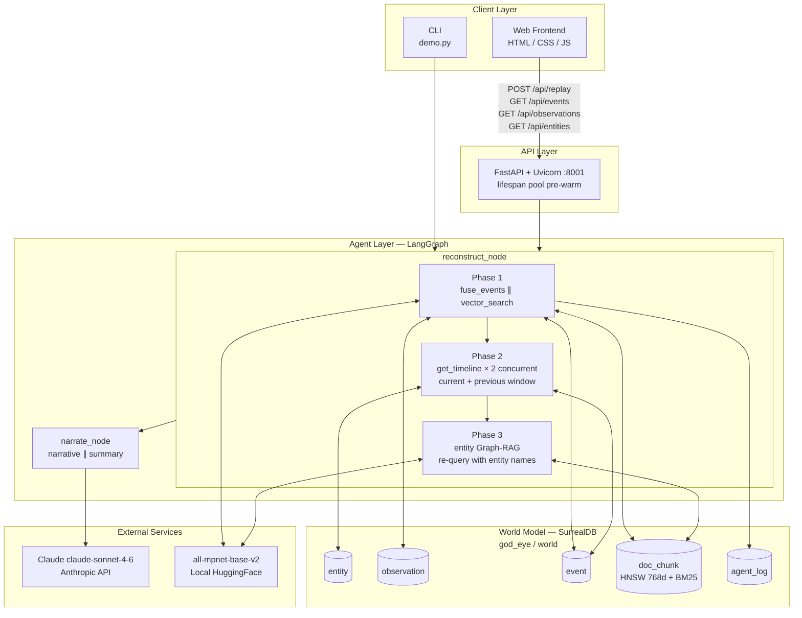
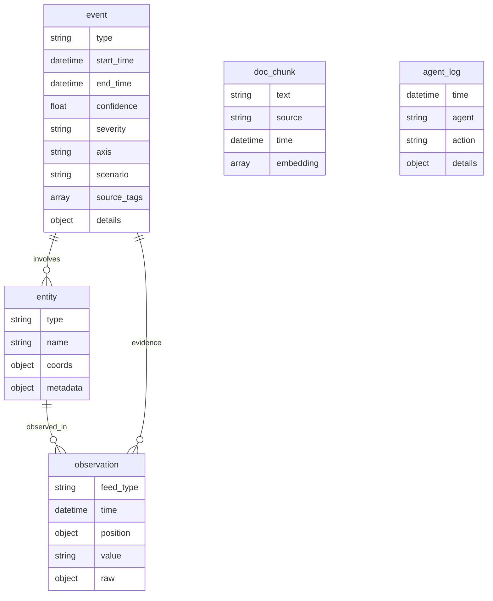

# System Architecture — GodEye

## Overview

GodEye is a time-resolved, multi-modal OSINT replay engine. It ingests heterogeneous sensor observations — ADS-B aircraft tracks, AIS vessel positions, GPS jamming detections, network events, and NOTAM-style documents — into a unified, persistent world model backed by SurrealDB. A LangGraph agent graph orchestrates event fusion, graph traversal, three-path hybrid retrieval, and LLM-driven narration to answer "what happened in this time window?" with a structured, evidence-grounded narrative.

The central design principle is **world-model grounding**: rather than treating each query as an isolated RAG lookup, GodEye maintains a knowledge graph that persists across requests. Observations link to entities; events link to observations and entities; documents are indexed for both semantic and keyword retrieval. The LLM operates over three distinct retrieval paths — query-driven RAG, entity-augmented Graph-RAG, and a baseline-only path — enabling per-request attribution of what the graph contributed beyond raw document retrieval.

---

## Key Requirements

**Functional**
- Ingest multi-modal time-stamped observations and fuse them into typed, Noisy-OR calibrated events grouped by feed type and 10-minute time buckets.
- Detect cross-feed correlations (≥2 feed types co-occurring in the same bucket) and surface them as first-class `type=correlation` events.
- Retrieve relevant documents via three paths: query-RAG (BM25+vector on the user question), entity-augmented Graph-RAG (re-query using entity names from detected events), and a baseline-only path for comparison.
- Compare the current replay window against the prior equal-duration window for temporal escalation/de-escalation analysis.
- Generate a structured narrative and per-cluster event summary via LLM.
- Expose a REST API and a web frontend for interactive replay and raw data access.
- Support scenario-scoped data isolation.

**Non-functional**
- **Low end-to-end latency:** Independent operations run concurrently via `asyncio.gather` with `return_exceptions=True`; cold-start connection cost is eliminated by pool pre-warming.
- **Fault isolation:** Every `asyncio.gather` uses `return_exceptions=True`; a failed BM25 index degrades gracefully to vector-only retrieval; individual tool failures never abort sibling operations.
- **Idempotency:** Re-running a replay for the same window produces the same result; existing events are deleted before re-fusion.
- **Thread safety:** Embedding model singleton initialises under a `threading.Lock` with double-checked locking — safe under concurrent `run_in_executor` calls.
- **Local-first:** Embeddings run on-device via HuggingFace sentence-transformers; no embedding API key required.
- **Configurability:** SurrealDB endpoint and Anthropic API key are environment-variable-driven.

---

## High-Level Architecture

GodEye comprises four logical layers: a **static frontend**, a **FastAPI HTTP gateway**, a **LangGraph agent graph**, and a **SurrealDB world model**. The agent graph is the processing core, running in three sequential phases within `reconstruct_node`. SurrealDB is the single source of truth for all data. Claude is the only external service dependency.



`reconstruct_node` runs three sequential phases: (1) fusion + query-RAG concurrently; (2) current and previous window timeline reads concurrently; (3) entity-augmented Graph-RAG using entity names extracted from detected events. `narrate_node` receives all three retrieval contexts and generates the narrative and event summary via two concurrent LLM calls. SurrealDB stores all graph edges, vector embeddings, time-series data, and audit logs.

---

## Component Details

### Web Frontend

**Responsibilities:** Render the replay UI; submit replay requests; display narrative, event summary, events table, and severity distribution.

**Technology:** Static HTML5, CSS3, vanilla JavaScript. No build step or framework dependency.

**Key behaviour:**
- Sends `POST /api/replay` on form submit or `Ctrl+Enter`; renders the JSON response using a pure-JS Markdown renderer (headings, bullet/numbered lists, inline bold/italic/code).
- `escapeHtml()` applied to all user-derived values before any DOM injection. Markdown patterns applied only after HTML escaping — XSS-safe by construction.
- `AbortController` cancels in-flight requests if the user re-submits before a response arrives.
- Displays skeleton loaders during request, severity distribution bar, confidence sparkbars, expandable row detail panel, and toast notifications.
- Copy-to-clipboard on the narrative panel; global `Ctrl+Enter` shortcut.
- Supports replay presets (save/load/delete), role views (`Analyst` / `Operator`), and richer analytics cards (diff, alerts, scorecard, latency, data quality).
- Observation map includes feed filters, mode filters (`All`, `Only Anomalies`, `High-Severity Linked`), a time scrubber with play/pause, marker detail panel, and interactive observation list.

**Owns no data.** All state lives in SurrealDB or the API response.

---

### FastAPI Gateway (`api/replay/api.py`)

**Responsibilities:** Validate inbound HTTP requests; invoke the LangGraph graph; return structured responses. Expose direct data endpoints that bypass the LLM pipeline.

**Technology:** FastAPI, Uvicorn, Pydantic v2.

**Endpoints:**

| Method | Path | Description |
|---|---|---|
| `GET` | `/health` | Pings SurrealDB; returns `{"status":"ok","db":"connected"}` or HTTP 503 |
| `GET` | `/api/events` | Returns fused events for a scenario/window without invoking the LLM |
| `GET` | `/api/observations` | Returns raw observations filtered by time and/or feed type (limit ≤1000) |
| `GET` | `/api/entities` | Returns all entities, optionally filtered by type |
| `GET` | `/api/scenarios` | Lists all distinct scenario names |
| `GET` | `/api/jamming/tankers` | High-severity jamming events linked to ship entities via graph traversal |
| `POST` | `/api/replay` | Full pipeline: fusion → timelines → Graph-RAG → LLM narration + runtime/observability metadata |

**Startup:** A FastAPI `lifespan` context manager pre-warms 3 SurrealDB pool connections at startup, eliminating the ~50ms WebSocket handshake + auth cost on the first 3 concurrent requests.

**Validation:** `ReplayRequest` Pydantic model validates `from_time`/`to_time` as ISO 8601 via `field_validator`. All GET endpoints validate optional datetime parameters inline. Invalid inputs return HTTP 422 before the agent graph or DB is touched.

**Error surface:** All agent and DB exceptions are caught and re-raised as `HTTPException` with static detail strings — no stack traces or internal messages leak to the client.

**Replay response metadata (evening update):**
- `runtime_metrics`: per-phase timing (`phase1_ms`, `phase2_ms`, `phase3_ms`, `total_reconstruct_ms`, `narrate_ms`, `total_ms`)
- `llm_model_used`: effective model ID used by narrative/summary generation
- `thread_id`: deterministic replay thread ID used by checkpointing
- `trace_url`: optional LangSmith run URL (when `LANGSMITH_RUN_BASE_URL` is configured)

---

### LangGraph Agent Graph (`src/agents/graph.py`)

**Responsibilities:** Orchestrate the two-node agent pipeline using async LangGraph nodes. Manage concurrency within each phase via `asyncio.gather(..., return_exceptions=True)`.

**Graph topology:**

```
reconstruct_node → narrate_node → END
```

#### `reconstruct_node` — three phases

**Phase 1 (concurrent):** `fuse_events` and `vector_search(user_q, k=5)` run simultaneously.
- `fuse_events` is a write side-effect; its return value is ignored — `get_timeline` is the authoritative read.
- `vector_search` result feeds `docs_structured` (k=3 top) and `docs_baseline` (all k=5).
- `return_exceptions=True` ensures a failed vector search does not abort a successful fusion, and vice versa.

**Phase 2 (concurrent):** Two `get_timeline` calls run simultaneously.
- Current window: `[from_time, to_time)` — the events just fused.
- Previous window: `[from_time - window_duration, from_time)` — read-only, whatever exists in DB. Non-fatal if empty or errored.
- Previous-window bounds computed synchronously from Pydantic-validated ISO strings — no additional error handling needed.

**Phase 3 (sequential):** Entity-augmented Graph-RAG.
- Extracts unique entity names from `timeline.entities`.
- If entity names exist, runs `vector_search(user_q + entity_names, k=3)`.
- Deduplicates against Phase 1 docs by text content.
- Skipped entirely (zero latency) if no entities were detected.

#### `narrate_node`

Runs two LLM calls concurrently:
1. **Narrative** — full structured-vs-baseline analysis across all three retrieval paths and the previous window comparison.
2. **Event summary** — per-cluster one-liners for the UI summary panel.

Prompt instructions are built dynamically — numbered items for previous-window comparison and Graph-RAG attribution only render when those contexts contain data.

**State (`src/agents/state.py`):** Typed `TypedDict(total=False)` carrying `mode`, `query`, `from_time`, `to_time`, `region`, `scenario`, `events`, `prev_events`, `context_docs`, `baseline_docs`, `entity_docs`, `event_summary`, `narrative`.

---

### Agent Tools (`src/agents/tools.py`)

Three LangChain `@tool`-decorated async functions. Each acquires a connection from the pool on entry and returns it on exit via `try/finally → db.close()`.

#### `fuse_events`

1. Deletes existing events for the window (idempotency guarantee).
2. Groups observations by `(feed_type, floor(time, 10m))` in a single SurrealDB LET/RETURN query.
3. For each group:
   - Computes `confidence = round(1.0 - 0.8 ** obs_count, 2)` (Noisy-OR, Pearl 1988).
   - Derives severity: `high` if confidence ≥ 0.67 or `feed_type == "jamming"`; `medium` if ≥ 0.36; else `low`.
   - Creates an `event` record with `details: {region_name}` when a region is provided.
   - Batch-links all observations via `evidence` edges in a single `FOR` loop query.
   - Resolves linked entities via graph traversal and creates `involves` edges.
4. Cross-feed correlation pass: for each bucket with ≥2 distinct feed types, creates `type=correlation`, `axis=multi`, `severity=high` using the same Noisy-OR confidence formula.
5. Logs start/end to `agent_log` (non-fatal; failures emit a warning and continue).

#### `get_timeline`

Single SurrealDB query returning events with their linked entities via `->involves->entity` traversal. Omits `->evidence->observation` — raw observations are not used in prompts or the frontend UI, and the multi-hop traversal bloated the LLM payload 5–10×.

#### `vector_search`

1. Embeds query string via `_get_embeddings().embed_query()` inside `run_in_executor` — CPU-bound inference runs in a `ThreadPoolExecutor`, keeping the event loop free for concurrent DB queries.
2. Issues BM25 (`text @@ $query`) and HNSW (`embedding <|k,COSINE|> $vec`) queries concurrently via `asyncio.gather(..., return_exceptions=True)` — a broken BM25 index does not prevent vector results from returning.
3. Merges via Reciprocal Rank Fusion: `score = Σ 1/(30 + rank)` (k=30, tuned for short OSINT corpora from default k=60 for web-scale). Returns top-k.

#### Connection Pool

`_pool: asyncio.Queue(maxsize=5)` holds reusable `AsyncSurreal` connections. `_PooledConn` wraps a connection and returns it to the pool on `close()` rather than terminating it — eliminating per-call WebSocket handshake + auth (~50ms each). Pool is pre-warmed at startup via the FastAPI `lifespan` hook.

---

### Embedding Model Singleton

**Technology:** `sentence-transformers/all-mpnet-base-v2` via `langchain_community.embeddings.HuggingFaceEmbeddings`.

**Specification:** 768 dimensions, MTEB STS 69.6. Selected over `all-MiniLM-L6-v2` (384d, 63.3) for ~10% better retrieval quality at acceptable CPU inference cost.

**Thread safety:** `_get_embeddings()` uses double-checked locking with `threading.Lock`. Without the lock, two concurrent requests on a cold start would both see `_embeddings is None` in the calling thread and double-load the 420MB model. The outer `None` check avoids lock contention on the hot path after initialisation.

**Lifecycle:** Lazy-loaded on the first `vector_search` call; cached as a module-level singleton for all subsequent calls.

---

### SurrealDB World Model

**Technology:** SurrealDB 3.x, namespace `god_eye`, database `world`.

**Node tables:**

| Table | Purpose |
|---|---|
| `entity` | Named assets (aircraft, vessels, infrastructure) with coordinates and metadata |
| `observation` | Raw sensor readings: feed type, timestamp, position, value, raw payload |
| `event` | Fused higher-level events: type, axis, severity, Noisy-OR confidence, source tags, scenario, time window, details |
| `doc_chunk` | Text intelligence fragments with 768-dim embedding, BM25 full-text index, and source/time metadata |
| `agent_log` | Structured audit trail of agent actions with timestamps |

**Edge tables:**

| Table | Semantics |
|---|---|
| `observed_in` | `entity → observation` — asset to sensor reading |
| `evidence` | `event → observation` — event to supporting observations (write-only; not read-back at query time) |
| `involves` | `event → entity` — event to implicated entities (read by `get_timeline` and Graph-RAG) |

**Indices:**

| Index | Type | Purpose |
|---|---|---|
| `doc_chunk_embedding` | HNSW, COSINE, 768d | Dense semantic vector search |
| `doc_chunk_fts` | BM25, `text_en` analyser (blank/class tokenisers, snowball English filter) | Keyword full-text search |

---

## Data Flow

### Replay Request

```mermaid
sequenceDiagram
  participant U as User
  participant FE as Frontend
  participant API as FastAPI
  participant RN as reconstruct_node
  participant DB as SurrealDB
  participant HF as Embeddings
  participant LLM as Claude

  U->>FE: Submit replay form (Ctrl+Enter)
  FE->>API: POST /api/replay
  API->>API: Validate timestamps (Pydantic)
  Note over API,RN: graph.ainvoke(state)

  rect rgb(40,60,80)
    Note over RN,HF: Phase 1 — concurrent
    RN->>DB: DELETE events for window
    RN->>DB: GROUP observations → buckets
    RN->>DB: CREATE events (Noisy-OR conf, severity)
    RN->>DB: RELATE evidence + involves edges
    RN->>DB: Correlation pass → CREATE multi events
    RN->>DB: LOG agent action
    RN->>HF: embed_query (run_in_executor)
    RN->>DB: BM25 text search ∥ HNSW vector search
    RN->>RN: RRF merge → top-k docs
  end

  rect rgb(40,80,60)
    Note over RN,DB: Phase 2 — concurrent
    RN->>DB: get_timeline current window (+entities)
    RN->>DB: get_timeline previous window (+entities)
  end

  rect rgb(80,60,40)
    Note over RN,HF: Phase 3 — entity Graph-RAG
    RN->>RN: Extract entity names from timeline
    RN->>HF: embed_query (entity-augmented)
    RN->>DB: BM25 ∥ HNSW on entity query
    RN->>RN: Deduplicate vs Phase 1 docs
  end

  rect rgb(60,40,80)
    Note over RN,LLM: narrate_node — concurrent
    RN->>LLM: Narrative prompt (events + 3 RAG paths + prev window)
    RN->>LLM: Summary prompt (events)
  end

  LLM-->>API: narrative + event_summary
  API-->>FE: {narrative, events, event_summary}
  FE-->>U: Rendered UI (narrative, summary, table)
```



---

## Data Model



**Key relationships:**
- An `entity` produces many `observation` records linked by `observed_in` edges (written at load time).
- An `event` is evidenced by one or more `observation` records via `evidence` edges (written at fusion time; not traversed at query time).
- An `event` involves zero or more `entity` records via `involves` edges (written at fusion time; traversed by `get_timeline` and used to build entity-augmented Graph-RAG queries).
- `doc_chunk` records are standalone; retrieved by HNSW + BM25 index. The `involves` entity graph provides indirect linkage — Graph-RAG uses entity names as query terms, not edge traversal.

---

## Infrastructure & Deployment

### Local development

| Process | Command |
|---|---|
| SurrealDB | `surreal start --user root --pass root` |
| API server | `uvicorn api.replay.api:app --reload --port 8001` |
| Frontend | Open `frontend/index.html` in browser (no build step) |
| Data loader | `python load_synthetic_world.py` (one-time; re-run after schema changes) |
| Demo CLI | `python demo.py` |

### Environment variables

```
ANTHROPIC_API_KEY=sk-ant-...          # required
SURREAL_URL=ws://127.0.0.1:8000/rpc  # optional; override for remote DB
```

### Production `<ADD DEPLOYMENT DETAILS HERE>`

- **SurrealDB:** Persistent storage (`surreal start file://./data`), non-default credentials, TLS endpoint.
- **API:** Containerised; externalise `API_BASE` URL from the frontend; restrict CORS to the frontend origin; add API key or OAuth2 bearer token gating.
- **Frontend:** Serve from the same reverse proxy with TLS termination; replace the hardcoded `http://localhost:8001` constant in `app.js`.
- **Embeddings:** Pre-download the model into the container image to avoid a cold-start download on first request.

---

## Scalability & Reliability

### Reliability mechanisms in place

| Mechanism | Implementation |
|---|---|
| **Idempotent fusion** | DELETE-before-write for every replay window; safe to retry |
| **Fault-isolated concurrency** | All `asyncio.gather` calls use `return_exceptions=True`; partial results are preserved |
| **Graceful retrieval degradation** | BM25 failure → vector-only; vector failure → BM25-only; both logged at WARNING |
| **Non-fatal observability** | `log_agent_action` failures emit a warning and continue; never abort business logic |
| **Structured LLM fallbacks** | Failed LLM calls return a human-readable string; API response structure is always valid JSON |
| **Connection pool** | `asyncio.Queue(maxsize=5)` of reusable SurrealDB WebSocket connections; pre-warmed at startup |
| **Thread-safe embeddings** | Double-checked locking on `_get_embeddings()` prevents duplicate 420MB model loads under concurrent cold starts |
| **Non-blocking embeddings** | `run_in_executor` offloads CPU-bound inference to a thread pool, keeping the event loop free |

### Current scaling constraints

- **Single-process:** No horizontal scaling or load balancing is configured. Uvicorn runs one worker by default.
- **5-connection pool cap:** Pool is bounded at 5. More than 5 simultaneous requests that all need DB access will create new ephemeral connections beyond the pool.
- **No streaming:** Replay responses are buffered in full before returning. LLM generation time (~3–8s) blocks the client request.

---

## Security & Compliance

| Area | Current status | Production recommendation |
|---|---|---|
| API authentication | None | Add API key header or OAuth2 bearer token |
| SurrealDB credentials | Default root/root in `.env` | Rotate credentials; inject via secrets manager |
| Secrets management | `.env` file (git-ignored) | Vault, AWS Secrets Manager, or equivalent |
| XSS prevention | `escapeHtml()` before all DOM injection; Markdown rendered on escaped input | Maintain; add `Content-Security-Policy` header |
| Query injection | Parameterised SurrealDB bindings throughout; f-string interpolation only for typed integer `fetch_k` | Maintain |
| LLM prompt injection | User query passed into prompt without sanitisation | Add system-prompt sandboxing instruction; consider input length cap |
| CORS | `allow_origins=["*"]` for local dev | Restrict to specific frontend origin in production |
| Transport security | HTTP only | TLS via reverse proxy for all external traffic |
| Data classification | Synthetic data only | Apply data classification, access control, and audit logging for real OSINT deployments |

---

## Observability

### Structured logging

All modules use `logging.getLogger(__name__)`. Key events:

| Module | Events |
|---|---|
| `src.agents.tools` | Fusion start/end, per-event creation errors, evidence/entity link failures, embedding failures, BM25/vector search failures |
| `src.agents.graph` | Phase 1/2 task failures, entity Graph-RAG failures, LLM call failures |
| `api.replay.api` | Pool pre-warm failures, DB query failures, graph invocation failures |

### Agent audit log

The `agent_log` SurrealDB table records structured agent actions:

```sql
SELECT * FROM agent_log ORDER BY time DESC LIMIT 20;
SELECT agent, action, count() FROM agent_log GROUP BY agent, action;
```

### Gaps `<ADD OBSERVABILITY TOOLING HERE>`

- No metrics export (Prometheus / OpenTelemetry). Recommended: instrument pipeline phase durations.
- No distributed tracing across LangGraph nodes and tool calls.
- No LLM token usage tracking. Recommended: log `resp.usage_metadata` per call to `agent_log`.
- No Graph-RAG uplift measurement (how often entity-augmented docs add new information vs. duplicate query-RAG results).

---

## Trade-offs & Design Decisions

| Decision | Choice | Rationale | Trade-off |
|---|---|---|---|
| **Database** | SurrealDB | Single store for graph, vector, and time-series; no polyglot persistence complexity | Less mature ecosystem; fewer managed hosting options |
| **LLM** | Anthropic Claude (`claude-sonnet-4-6`) | Strong instruction-following and structured output for OSINT analysis | External API dependency; per-request cost and latency |
| **Embeddings** | `all-mpnet-base-v2`, local | No API key; no egress latency; 768-dim MTEB STS 69.6 (~10% better than MiniLM) | ~420MB model; CPU inference ~150ms per call |
| **Retrieval** | Hybrid BM25 + HNSW via RRF (k=30) | Keyword OSINT queries fail with dense-only; RRF consistently outperforms either alone; k=30 tuned for short domain corpora | Two indices; two concurrent queries; RRF merge logic |
| **Graph-RAG** | Entity-name query augmentation | Works within current schema (no entity→doc_chunk edges); uses entity names as query terms | Approximation of true graph-traversal RAG; misses entities not named in doc chunks |
| **Confidence** | Noisy-OR: `1 - 0.8ⁿ` | Calibrated; never reaches 1.0 with finite evidence; published basis (Pearl 1988); self-consistent with severity thresholds | Does not account for observation quality or source reliability |
| **Severity** | Derived from confidence thresholds (≥0.67 high, ≥0.36 medium) | Self-consistent with Noisy-OR model; same boundary points as the old obs_count thresholds | Jamming always high regardless of confidence — hard-coded domain knowledge |
| **Event fusion** | Fixed 10-minute buckets via `time::floor` | Simple; no configuration; single SurrealDB query | Does not adapt to burst patterns; events straddling a boundary are split |
| **Concurrency** | `asyncio.gather(..., return_exceptions=True)` within graph nodes | Eliminates serial I/O wait; fault-isolated; partial results preserved | Two simultaneous queries on one SurrealDB connection; relies on client WebSocket multiplexing |
| **Previous window** | Equal-duration lookback, read-only | Zero extra DB cost for fusion; sensible default for before/after comparison | Fixed lookback may not match the analyst's mental model of "previous period" |
| **Graph topology** | Linear two-node pipeline | Minimal complexity; easy to extend with additional nodes | No branching, conditional routing, retry, or parallelism at the graph level |
| **Frontend** | Vanilla JS, no build step | Zero install friction for a demo and teaching tool | Not suitable for complex production UI or state management |

---

## Future Improvements

- **DBSCAN spatiotemporal clustering** — Replace hard 10-minute buckets with density-based grouping over `(lat, lon, time)` feature space, eliminating split-at-boundary artefacts and adapting to burst patterns.
- **True Graph-RAG** — Add `doc_chunk → entity` edges at load time and traverse them at retrieval time, enabling genuine graph-neighbourhood document discovery rather than entity-name query augmentation.
- **Isolation Forest anomaly scoring** — Per-observation anomaly scores against a rolling baseline observation rate per feed type, replacing fixed confidence-from-count with a model sensitive to temporal context.
- **Streaming responses** — SSE or WebSocket endpoint for progressive narrative rendering as the LLM generates, eliminating the 3–8s blocked client wait.
- **Horizontal scaling** — Multiple Uvicorn workers behind a load balancer; shared SurrealDB cluster with connection string environment configuration.
- **OpenTelemetry instrumentation** — Spans around each pipeline phase and tool call for end-to-end latency breakdown and distributed tracing.
- **LLM token usage logging** — Capture `usage_metadata` per call to `agent_log` for cost tracking and capacity planning.
- **Test suite** — `pytest` unit tests for fusion logic (Noisy-OR, severity thresholds, correlation detection) and an integration test running the full LangGraph pipeline against a schema-applied in-memory SurrealDB instance.
- **Production hardening** — TLS, credential rotation via secrets manager, API key gating, CORS restriction, multi-worker containerisation.
