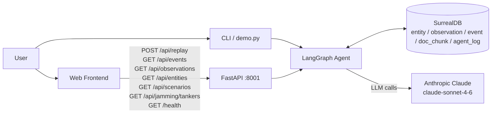
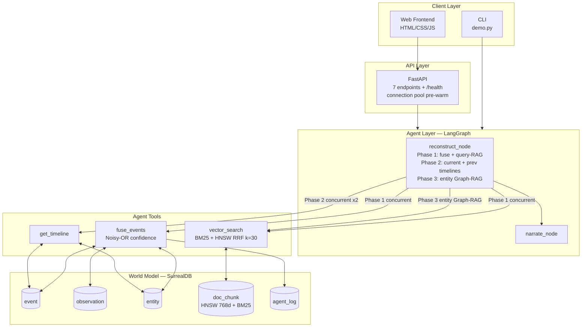
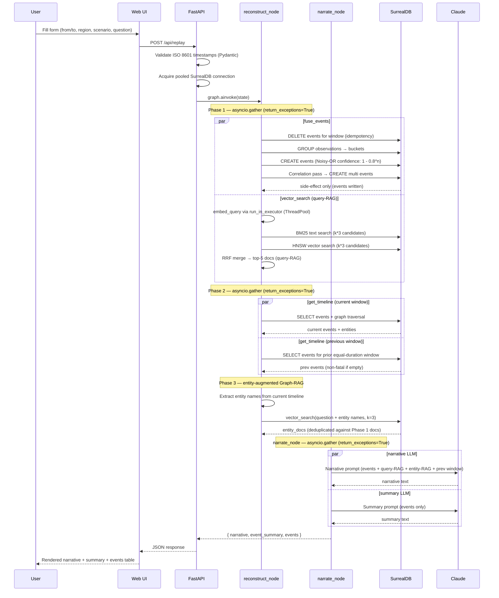
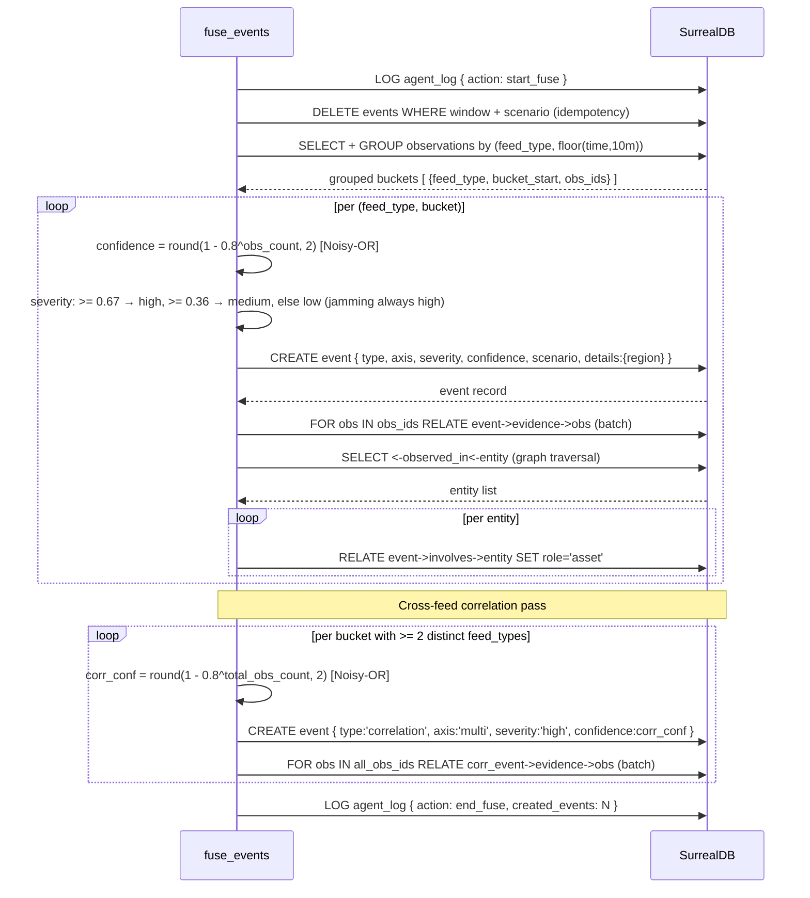
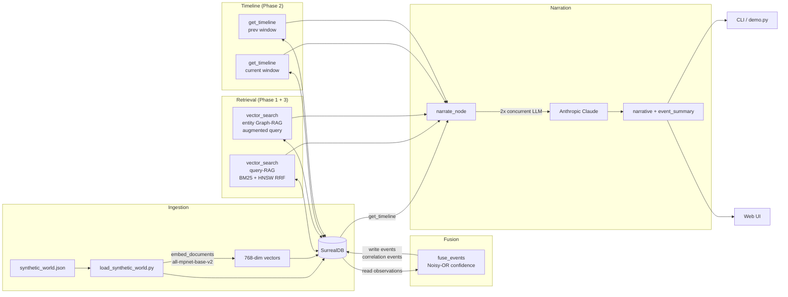
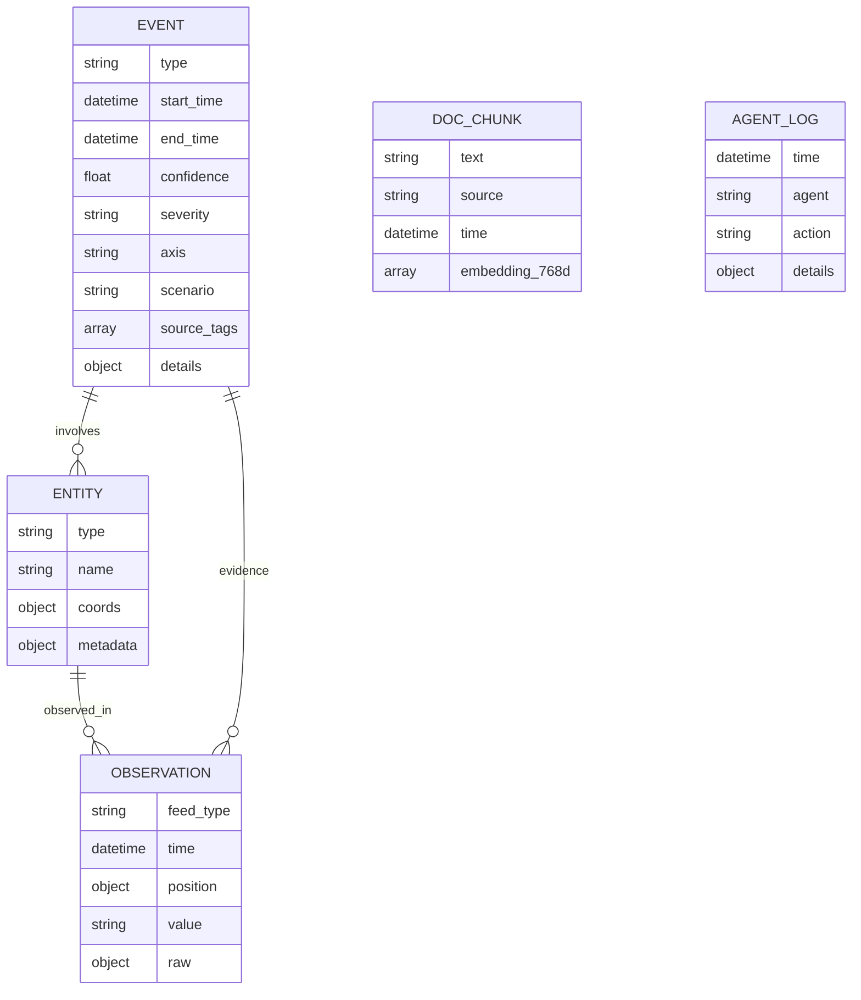

1. High-level system context

The four main actors: user (web or CLI), FastAPI gateway, LangGraph agent, SurrealDB world model.
Anthropic is the only external service dependency; all other state is local.
FastAPI pre-warms the SurrealDB connection pool (asyncio.Queue, maxsize=5) at startup via lifespan.


2. Container / component view

Both CLI and web paths converge on the same LangGraph graph and SurrealDB instance.
reconstruct_node runs three sequential phases, each with internal concurrency.
Phase 2 fires two get_timeline calls concurrently: current window and the prior equal-duration window.
Phase 3 re-queries doc_chunk using entity names extracted from the detected event graph.


3. Sequence: replay request (web path)

Three sequential phases in reconstruct_node, each with internal asyncio.gather concurrency.
All gather calls use return_exceptions=True: a failed BM25 or previous-window fetch degrades gracefully without aborting the request.
Phase 3 only fires when Phase 2 surfaces at least one entity; entity_docs are deduplicated against Phase 1 docs.


4. Sequence: event fusion in detail

DELETE-before-write makes fusion idempotent. Evidence linking is batched (one query per event, not per observation).
Noisy-OR confidence (Pearl 1988): each additional observation independently raises confidence, approaching 1.0 asymptotically.
n=1 → 0.20 (tentative), n=2 → 0.36, n=5 → 0.67 (strong). Severity thresholds align to these natural breakpoints.
The correlation pass runs after the main loop. Its confidence also uses Noisy-OR over the combined observation pool.


5. Sequence: hybrid vector retrieval (RRF)
```mermaid
sequenceDiagram
  participant VS as vector_search
  participant EM as all-mpnet-base-v2\n(local CPU, ThreadPoolExecutor)
  participant DB as SurrealDB

  VS->>EM: run_in_executor(embed_query, user_query)
  note over EM: CPU-bound — offloaded to thread;\nevent loop stays free
  EM-->>VS: 768-dim vector

  par asyncio.gather (return_exceptions=True)
    VS->>DB: SELECT doc_chunk WHERE text @@ query LIMIT k*3  (BM25)
    DB-->>VS: bm25_rows [ ranked by BM25 score ]
  and
    VS->>DB: SELECT doc_chunk WHERE embedding <|k*3,COSINE|> vec  (HNSW)
    DB-->>VS: vec_rows [ ranked by cosine similarity ]
  end

  note over VS: Graceful degradation: if BM25 fails → vector only;\nif HNSW fails → BM25 only
  VS->>VS: RRF merge: score[id] += 1/(30 + rank) for each list
  VS->>VS: sort by RRF score, return top-k
```
Both DB queries are independent and run concurrently. return_exceptions=True allows either index to fail gracefully.
run_in_executor prevents the synchronous sentence-transformers encode from blocking the asyncio event loop.
RRF k=30 (tuned for short OSINT corpora) rewards documents that rank highly in either list and doubly rewards those that rank well in both.
The embeddings singleton is initialised once under a threading.Lock (double-checked locking) to prevent duplicate model loads under concurrent requests.


6. Data flow: ingestion to replay

Pipeline: fixtures → DB (with 768-dim embeddings) → fusion + correlation → hybrid retrieval (query-RAG) → timeline (current + prev) → entity Graph-RAG → LLM narration → outputs.
Phase 3 entity Graph-RAG re-queries doc_chunk using entity names discovered in Phase 2, surfacing NOTAM/advisory docs the user did not know to ask for.


7. Data model (entities and relations)

EVENT.type may be 'anomaly', 'jamming', or 'correlation' (multi-feed co-occurrence).
EVENT.confidence uses Noisy-OR (Pearl 1988): 1 - 0.8^n. n=1 → 0.20 tentative, n=2 → 0.36, n=5 → 0.67 strong.
EVENT.details stores {region_name} when a region is provided; null otherwise.
DOC_CHUNK has two indices: HNSW (768d COSINE) for vector search and BM25 (text_en analyser) for keyword search.
AGENT_LOG is standalone — populated by fuse_events with start_fuse / end_fuse records; log failures never abort business logic.
