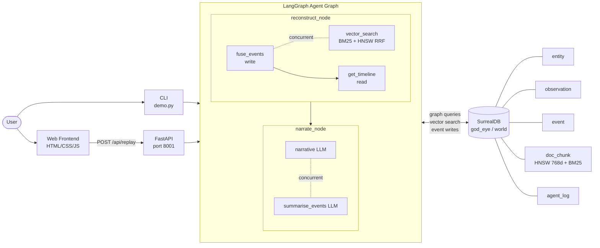

# GodEye

**4D OSINT Replay Engine — time-resolved, multi-modal intelligence over a unified graph + vector world model.**


---

## Description

GodEye ingests time-stamped multi-modal sensor observations (ADS-B, AIS, GPS jamming, network events, NOTAM-style documents) into SurrealDB, fuses them into higher-level events, links them to entities via a knowledge graph, and exposes a **4D replay agent** that answers "what happened in this window?" with a structured, evidence-grounded narrative.

Unlike shallow RAG systems that retrieve documents and hope for the best, GodEye grounds its reasoning in a **persistent, multi-model world model**: a graph of entities, observations, and events, enriched with hybrid vector + BM25 document retrieval. The agent explicitly contrasts what it can conclude *with* the event graph versus *without* it.

Built for AI engineers, data engineers, and OSINT-curious developers who want a concrete pattern for production-shaped agent workflows over graph + vector data.

---

## Table of Contents

- [Features](#features)
- [Tech Stack](#tech-stack)
- [Architecture Overview](#architecture-overview)
- [Installation](#installation)
- [Usage](#usage)
- [Configuration](#configuration)
- [Screenshots / Demo](#screenshots--demo)
- [API Reference](#api-reference)
- [Tests](#tests)
- [Roadmap](#roadmap)
- [Contributing](#contributing)
- [License](#license)
- [Contact / Support](#contact--support)

---

## Features

- **Multi-model world model** — SurrealDB stores `entity`, `observation`, `event`, and `doc_chunk` tables with graph edges (`observed_in`, `involves`, `evidence`) linking them into a traversable knowledge graph.
- **Time-windowed event fusion** — Groups observations by feed type and 10-minute buckets into typed events. Confidence is calibrated by observation count (Dempster-Shafer evidence accumulation); severity is tiered accordingly.
- **Cross-feed correlation detection** — When ≥2 distinct feed types fire in the same 10-minute window, a `multi`-axis `correlation` event is automatically created, surfacing compound signals the LLM would otherwise have to infer itself.
- **Hybrid BM25 + vector retrieval** — `doc_chunk` retrieval uses Reciprocal Rank Fusion (Cormack et al. 2009) over a concurrent BM25 full-text search and HNSW cosine vector search, outperforming either alone on keyword-heavy OSINT queries.
- **High-quality embeddings** — `all-mpnet-base-v2` (768-dim, MTEB STS 69.6) runs locally with no API key required.
- **Parallel LangGraph pipeline** — Event fusion and vector search run concurrently; narrative generation and event summarisation run concurrently. End-to-end latency is minimised without sacrificing correctness.
- **Structured vs baseline comparison** — The agent explicitly explains what it could *not* have concluded using only RAG, demonstrating the value of the event graph.
- **Minimal agent observability** — All agent actions are logged to an `agent_log` table in SurrealDB with timestamps and structured details.
- **FastAPI backend + OBSIDIAN GRID frontend** — A glassmorphism dark-mode UI with bento-card layout, markdown-rendered narratives, severity-badged event table, and real-time status indicators.

---

## Tech Stack

| Layer | Technology |
|---|---|
| Language | Python 3.11+ |
| Database | SurrealDB 3.x (graph, vector, time-series) |
| Agent orchestration | LangGraph |
| LLM | Anthropic Claude (`claude-sonnet-4-6`) via LangChain |
| Embeddings | HuggingFace `sentence-transformers/all-mpnet-base-v2` (local, no API key) |
| Backend | FastAPI + Uvicorn |
| Frontend | Static HTML / CSS / JavaScript |

---

## Architecture Overview



The user interacts via a web UI or the `demo.py` CLI. Both paths invoke the LangGraph agent graph, which first fuses raw observations into typed events (writing to SurrealDB), retrieves the enriched timeline, and concurrently runs hybrid document retrieval. A second node generates the narrative and event summary in parallel via two concurrent LLM calls. SurrealDB acts as the single source of truth for all graph, vector, and time-series data.

---

## Installation

### Prerequisites

- Python 3.11+
- SurrealDB 3.x binary (`surreal`) — [download here](https://surrealdb.com/install)
- An Anthropic API key

### 1. Clone the repository

```bash
git clone <ADD_REPO_URL_HERE> god-eye
cd god-eye
```

### 2. Install Python dependencies

```bash
pip install -r requirements.txt
```

### 3. Start SurrealDB

In a separate terminal:

```bash
surreal start --user root --pass root
```

### 4. Apply the schema

In the SurrealDB shell (`surreal sql --user root --pass root`):

```sql
USE NS god_eye DB world;
SOURCE "schema.surql";
```

### 5. Configure environment

```bash
cp .env.example .env
# Edit .env and set ANTHROPIC_API_KEY=sk-ant-...
```

### 6. Load synthetic data

```bash
python load_synthetic_world.py
```

Verify in the SurrealDB shell:

```sql
SELECT * FROM observation LIMIT 5;
SELECT * FROM doc_chunk LIMIT 5;
```

> **Note:** If you previously loaded data with an older schema (384-dim embeddings), drop the `doc_chunk` table and re-run the loader after applying the updated `schema.surql` to rebuild the 768-dim HNSW index.

---

## Usage

### Terminal demo (recommended first run)

```bash
python demo.py
```

Expected output:

```
=== GOD EYE DEMO ===

Narrative (structured vs baseline):
[LLM-generated explanation referencing fused events and RAG docs...]

Event summary:
[Per-cluster one-liners with axis, severity, confidence...]

Events (structured graph):
- event:abc123 | anomaly    | axis=air   | severity=medium | tags=['adsb', 'auto-fuse']
- event:def456 | jamming    | axis=cyber | severity=high   | tags=['jamming', 'auto-fuse']
- event:ghi789 | correlation| axis=multi | severity=high   | tags=['adsb', 'jamming', 'auto-correlate']

Structured RAG docs:
- NOTAM @ 2026-02-28T02:00:00Z: NOTAM: Airspace restrictions in the Strait...

Baseline RAG docs (no events):
- news @ 2026-02-28T03:00:00Z: Open-source reports indicate intermittent...
```

### Web UI + API

Start the API server:

```bash
uvicorn api.replay.api:app --reload --port 8001
```

Open `frontend/index.html` in your browser (or serve `frontend/` via any static file server).

Fill in the form fields:

| Field | Example |
|---|---|
| From (UTC) | `2026-02-28T02:00:00Z` |
| To (UTC) | `2026-02-28T04:00:00Z` |
| Region | `Hormuz` |
| Scenario | `EPIC_FURY_DEMO` |
| Question | `What anomalies occurred near Hormuz?` |

Click **Run Replay**. The UI renders:

- A markdown-formatted narrative panel with AI analysis badge
- A concise event summary
- A sortable events table (ID, type, axis, severity, start time, source tags)

---

## Configuration

### Environment variables

| Variable | Required | Default | Description |
|---|---|---|---|
| `ANTHROPIC_API_KEY` | Yes | — | Anthropic API key for Claude LLM calls |
| `SURREAL_URL` | No | `ws://127.0.0.1:8000/rpc` | SurrealDB WebSocket RPC endpoint |

### Database

- Namespace: `god_eye`
- Database: `world`
- Defined in `schema.surql` — re-apply after any schema change, then re-run `load_synthetic_world.py`

### Scenarios

Events are tagged with `scenario = 'EPIC_FURY_DEMO'` by default. The API and frontend both accept a `scenario` field — add new scenarios by loading fixture data tagged with a different scenario name.

### Embedding model

The HNSW index dimension (`768`) and the model name (`sentence-transformers/all-mpnet-base-v2`) must stay in sync across `schema.surql`, `src/agents/tools.py`, and `load_synthetic_world.py`. If you swap models, update all three and re-run the loader.

---

## Screenshots / Demo

> Replace the placeholders below with real screenshots once you have them.

**Architecture / terminal demo:**


**Web UI replay:**


**Live demo / deployment:** `<ADD_LIVE_DEMO_URL_HERE>`

---

## API Reference

### `POST /api/replay`

Run the full LangGraph replay pipeline for a time window.

**Request body:**

```json
{
  "mode": "replay",
  "from_time": "2026-02-28T02:00:00Z",
  "to_time": "2026-02-28T04:00:00Z",
  "region": "Hormuz",
  "scenario": "EPIC_FURY_DEMO",
  "query": "What anomalies occurred in this window?"
}
```

**Response:**

```json
{
  "narrative": "In this window, a GPS jamming burst co-occurring with anomalous AIS tracks...",
  "events": [
    {
      "id": "event:abc123",
      "type": "correlation",
      "axis": "multi",
      "severity": "high",
      "confidence": 0.8,
      "start_time": "2026-02-28T02:10:00Z",
      "source_tags": ["adsb", "jamming", "auto-correlate"],
      "observations": [...],
      "entities": [...]
    }
  ],
  "event_summary": "**Correlation (multi/high):** ADS-B + jamming co-occurrence at 02:10 UTC..."
}
```

### `GET /api/events`

Query events directly from SurrealDB without running the LLM pipeline.

```
GET /api/events?scenario=EPIC_FURY_DEMO&from_time=2026-02-28T02:00:00Z&to_time=2026-02-28T04:00:00Z
```

### `GET /health`

Returns `{"status": "ok", "db": "connected"}` if SurrealDB is reachable, or HTTP 503 if not.

---

## Tests

No automated test suite is included in this release. To manually sanity-check the system:

```sql
-- In the SurrealDB shell
SELECT * FROM event LIMIT 10;
SELECT * FROM agent_log ORDER BY time DESC LIMIT 10;
SELECT count() FROM doc_chunk GROUP ALL;
```

To run the end-to-end pipeline:

```bash
python demo.py
```

**Planned:** unit tests for fusion logic and a LangGraph integration test against an in-memory SurrealDB instance using `pytest`. Contributions welcome.

---

## Roadmap

- Add real data sources (live ADS-B via dump1090, AIS via AISHub, OSINT feeds) with a configurable ingestion pipeline.
- Implement proper spatiotemporal clustering for events (DBSCAN on position + time) beyond simple time bucketing.
- Graph-RAG: retrieve `doc_chunk` records by entity/event graph neighbourhood rather than embedding proximity alone.
- Density-based anomaly scoring with Isolation Forest against a rolling baseline observation rate.
- 3D globe or map visualisation (globe.gl / MapLibre) rendered over the events JSON.
- Agent metrics dashboard: per-request latency breakdown, event counts, confidence distributions.
- Local LLM / embeddings option for offline or cost-sensitive deployments.

---

## Contributing

Contributions are welcome.

- Open a GitHub Issue for bugs, feature requests, or questions.
- For pull requests: fork the repo, create a focused feature branch, keep changes scoped, and include a brief description of what you changed and why.
- Follow existing code style: async Python, typed where practical, errors logged not swallowed.

`<ADD_CONTRIBUTING_LINK_OR_GUIDELINES_HERE>`

---

## License

This project is licensed under the **MIT License**. See the [LICENSE](LICENSE) file for details.

---

## Contact / Support

- **Maintainer:** `<ADD_MAINTAINER_NAME_HERE>`
- **GitHub:** `<ADD_GITHUB_PROFILE_OR_ORG_HERE>`
- **Website:** `<ADD_WEBSITE_OR_BLOG_URL_HERE>`
- **Email:** `<ADD_CONTACT_EMAIL_HERE>`

For bugs and feature requests, please open a [GitHub Issue](<ADD_REPO_URL_HERE>/issues).
