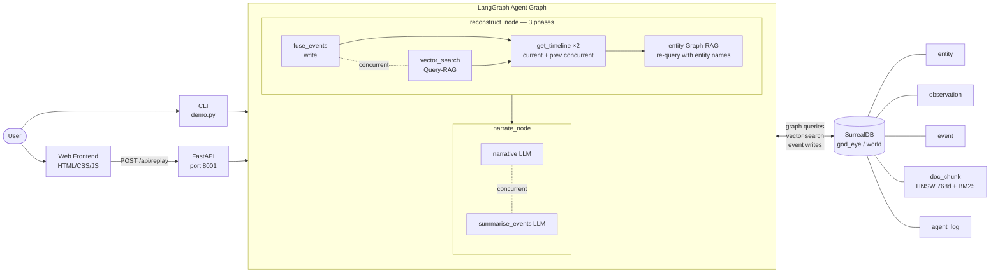

# GodEye

**4D OSINT Replay Engine — time-resolved, multi-modal intelligence over a unified graph + vector world model.**


---

## Description

GodEye ingests time-stamped multi-modal sensor observations (ADS-B, AIS, GPS jamming, network events, NOTAM-style documents) into SurrealDB, fuses them into higher-level events, links them to entities via a knowledge graph, and exposes a **4D replay agent** that answers "what happened in this window?" with a structured, evidence-grounded narrative.

Unlike shallow RAG systems that retrieve documents and hope for the best, GodEye grounds its reasoning in a **persistent, multi-model world model**: a graph of entities, observations, and events, enriched with three distinct retrieval paths — query-driven RAG, entity-augmented Graph-RAG, and a baseline-only path for comparison. The agent explicitly contrasts what it can conclude *with* the event graph versus *without* it.

Built for AI engineers, data engineers, and OSINT-curious developers who want a concrete, production-shaped pattern for agent workflows over graph + vector data.

---

## Table of Contents

- [Features](#features)
- [Tech Stack](#tech-stack)
- [Architecture Overview](#architecture-overview)
- [Installation](#installation)
- [Usage](#usage)
- [Configuration](#configuration)
- [Screenshots / Demo](#screenshots--demo)
- [API Reference](#api-reference)
- [Tests](#tests)
- [Roadmap](#roadmap)
- [Contributing](#contributing)
- [License](#license)
- [Contact / Support](#contact--support)

---

## Features

- **Multi-model world model** — SurrealDB stores `entity`, `observation`, `event`, and `doc_chunk` tables with graph edges (`observed_in`, `involves`, `evidence`) linking them into a traversable knowledge graph.
- **Time-windowed event fusion** — Groups observations by feed type and 10-minute buckets into typed events with Noisy-OR calibrated confidence (`1 - 0.8ⁿ`) and severity derived from evidence thresholds.
- **Cross-feed correlation detection** — When ≥2 distinct feed types fire in the same 10-minute window, a `multi`-axis `correlation` event is created, surfacing compound signals the LLM would otherwise have to infer itself.
- **Three-phase retrieval pipeline** — Query-RAG (BM25+vector on the user question), entity-augmented Graph-RAG (re-queries using names of entities detected in the event graph), and a baseline-only path for structured-vs-baseline comparison.
- **Hybrid BM25 + vector retrieval with RRF** — `doc_chunk` retrieval merges BM25 full-text and HNSW cosine vector search via Reciprocal Rank Fusion (Cormack et al. 2009, k=30), outperforming either alone on keyword-heavy OSINT queries.
- **Before/after window comparison** — Each replay automatically fetches the prior equal-duration window and feeds it to the LLM for escalation/de-escalation analysis.
- **Parallel LangGraph pipeline** — Fusion + vector search concurrent (Phase 1); current + previous timelines concurrent (Phase 2); narrative + event summary LLM calls concurrent. Cold-start pool pre-warming eliminates connection overhead on first requests.
- **Fault-isolated concurrency** — All `asyncio.gather` calls use `return_exceptions=True`; a failed BM25 index gracefully degrades to vector-only retrieval, and vice versa.
- **Structured vs baseline comparison** — The narrative explicitly explains what the agent could *not* have concluded using only RAG, demonstrating the value of the event graph per-request.
- **Agent observability** — All agent actions logged to `agent_log` in SurrealDB with timestamps and structured details. Non-fatal: log failures never abort business logic.
- **Persistent agent memory** — Checkpoints are persisted to SurrealDB (`agent_checkpoint`) via a custom `SurrealDBCheckpointSaver` so replay sessions can resume across process restarts.
- **FastAPI backend + glassmorphism frontend** — Dark-mode bento-card UI with markdown-rendered narratives, severity-badged expandable event table, confidence sparkbars, and copy-to-clipboard.

---

## Tech Stack

| Layer | Technology |
|---|---|
| Language | Python 3.11+ |
| Database | SurrealDB 3.x (graph, vector, time-series in one engine) |
| Agent orchestration | LangGraph |
| LLM | Anthropic Claude (`claude-sonnet-4-6`) via LangChain |
| Embeddings | HuggingFace `sentence-transformers/all-mpnet-base-v2` (768-dim, local) |
| Backend | FastAPI + Uvicorn |
| Frontend | Static HTML / CSS / JavaScript (no build step) |

---

## Architecture Overview



`reconstruct_node` runs in three phases: (1) event fusion and query-RAG concurrently, (2) current and previous-window timeline reads concurrently, (3) entity-augmented Graph-RAG using entity names extracted from the detected events. `narrate_node` receives all three retrieval contexts and generates the narrative and event summary via two concurrent LLM calls. SurrealDB serves as the single source of truth for all graph, vector, and time-series data.

---

## Installation

### Prerequisites

- Python 3.11+
- SurrealDB 3.x binary (`surreal`) — [download here](https://surrealdb.com/install)
- An Anthropic API key

### 1. Clone the repository

```bash
git clone https://github.com/MasteraSnackin/GodEye.git
cd GodEye
```

### 2. Install Python dependencies

```bash
pip install -r requirements.txt
```

### 3. Start SurrealDB

In a separate terminal:

```bash
surreal start --user root --pass root
```

### 4. Apply the schema

In the SurrealDB shell (`surreal sql --user root --pass root`):

```sql
USE NS god_eye DB world;
SOURCE "schema.surql";
```

### 5. Configure environment

```bash
cp .env.example .env
# Edit .env and set ANTHROPIC_API_KEY=sk-ant-...
```

### 6. Load synthetic data

```bash
python load_synthetic_world.py
```

Verify in the SurrealDB shell:

```sql
SELECT * FROM observation LIMIT 5;
SELECT count() FROM doc_chunk GROUP ALL;
```

> **Note:** If you previously loaded data with an older schema (384-dim embeddings), drop the `doc_chunk` table and re-run the loader after applying the updated `schema.surql` to rebuild the 768-dim HNSW index.

---

## Usage

### Terminal demo (recommended first run)

```bash
python demo.py
```

Expected output:

```
=== GOD EYE DEMO ===

Narrative (structured vs baseline):
[LLM-generated explanation referencing fused events, Graph-RAG docs, and entity-linked context...]

Event summary:
[Per-cluster one-liners with axis, severity, Noisy-OR confidence...]

Events (structured graph):
- event:abc123 | anomaly    | axis=air   | severity=medium | tags=['adsb', 'auto-fuse']
- event:def456 | jamming    | axis=cyber | severity=high   | tags=['jamming', 'auto-fuse']
- event:ghi789 | correlation| axis=multi | severity=high   | tags=['adsb', 'jamming', 'auto-correlate']

Structured RAG docs (query-RAG):
- NOTAM @ 2026-02-28T02:00:00Z: Airspace restrictions in the Strait...

Graph-RAG docs (entity-augmented):
- advisory @ 2026-02-28T03:00:00Z: SIRIUS STAR route advisory — GPS degradation...
```

### Web UI + API

Start the API server:

```bash
uvicorn api.replay.api:app --reload --port 8001
```

Open `frontend/index.html` in your browser (or serve `frontend/` via any static file server).

Fill in the form fields:

| Field | Example |
|---|---|
| From (UTC) | `2026-02-28T02:00:00Z` |
| To (UTC) | `2026-02-28T04:00:00Z` |
| Region | `Hormuz` |
| Scenario | `EPIC_FURY_DEMO` |
| Question | `What anomalies occurred near Hormuz?` |

Click **Run Replay** (or press `Ctrl+Enter`). The UI renders:

- A markdown-formatted narrative with AI Analysis badge and copy-to-clipboard
- A concise per-cluster event summary
- An expandable events table (ID, type, axis, severity, confidence sparkbar, start time, tags)
- A severity distribution bar across the event set

---

## Configuration

### Environment variables

| Variable | Required | Default | Description |
|---|---|---|---|
| `ANTHROPIC_API_KEY` | Yes | — | Anthropic API key for Claude LLM calls |
| `SURREAL_URL` | No | `ws://127.0.0.1:8000/rpc` | SurrealDB WebSocket RPC endpoint |
| `SURREAL_USER` | No | `root` | SurrealDB username |
| `SURREAL_PASSWORD` | No | `root` | SurrealDB password |
| `CORS_ORIGINS` | No | `http://localhost:8001,http://127.0.0.1:8001` | Comma-separated allowed origins for browser clients |
| `GODEYE_API_KEYS` | No | (unset) | Comma-separated API keys for optional API authentication (`X-API-Key`). Leave unset to disable auth in local mode |
| `GODEYE_CHECKPOINT_LIMIT` | No | (unset) | Optional checkpoint retention policy per `thread_id` and namespace. `unset` = unlimited, `0` = keep none, positive integer keeps the most recent N checkpoints |

### Database

- Namespace: `god_eye`
- Database: `world`
- Defined in `schema.surql` — re-apply after any schema change, then re-run `load_synthetic_world.py`

### Scenarios

Events are tagged with `scenario = 'EPIC_FURY_DEMO'` by default. The API and frontend accept a `scenario` field — add scenarios by loading fixture data tagged with a different scenario name.

### Embedding model

The HNSW index dimension (`768`) and model name (`sentence-transformers/all-mpnet-base-v2`) must stay in sync across `schema.surql`, `src/agents/tools.py`, and `load_synthetic_world.py`. Update all three and re-run the loader if switching models.

---

## Screenshots / Demo

> Replace the placeholders below with real screenshots once available.

**Architecture / terminal demo:**


**Web UI replay:**


**Live demo / deployment:** `<ADD_LIVE_DEMO_URL_HERE>`

---

## API Reference

### `POST /api/replay`

Run the full LangGraph replay pipeline for a time window.

**Request body:**

```json
{
  "mode": "replay",
  "from_time": "2026-02-28T02:00:00Z",
  "to_time": "2026-02-28T04:00:00Z",
  "region": "Hormuz",
  "scenario": "EPIC_FURY_DEMO",
  "query": "What anomalies occurred in this window?"
}
```

**Response:**

```json
{
  "narrative": "In this window, a GPS jamming burst co-occurring with anomalous AIS tracks...",
  "events": [
    {
      "id": "event:abc123",
      "type": "correlation",
      "axis": "multi",
      "severity": "high",
      "confidence": 0.67,
      "start_time": "2026-02-28T02:10:00Z",
      "source_tags": ["adsb", "jamming", "auto-correlate"],
      "entities": [{"id": "entity:ship1", "name": "SIRIUS STAR", "type": "ship"}]
    }
  ],
  "event_summary": "**Correlation (multi/high, conf=0.67):** ADS-B + jamming co-occurrence at 02:10 UTC..."
}
```

### `GET /api/events`

Query fused events directly without running the LLM pipeline.

```
GET /api/events?scenario=EPIC_FURY_DEMO&from_time=2026-02-28T02:00:00Z&to_time=2026-02-28T04:00:00Z
```

### `GET /api/observations`

Query raw sensor observations by time window and/or feed type.

```
GET /api/observations?from_time=2026-02-28T02:00:00Z&to_time=2026-02-28T04:00:00Z&feed_type=jamming&limit=100
```

| Parameter | Required | Description |
|---|---|---|
| `from_time` | No | ISO 8601 start (inclusive) |
| `to_time` | No | ISO 8601 end (exclusive) |
| `feed_type` | No | Filter: `adsb` \| `ais` \| `jamming` \| `net` \| `sat_pass` |
| `limit` | No | Max results (default 100, max 1000) |

### `GET /api/entities`

Query all entities in the knowledge graph.

```
GET /api/entities?entity_type=ship
```

### `GET /api/scenarios`

List all distinct scenario names present in the database.

```
GET /api/scenarios
```

### `GET /api/jamming/tankers`

High-severity jamming events where at least one involved entity is a ship. Walks the graph via `involves→entity` edges.

```
GET /api/jamming/tankers?from_time=2026-02-28T02:00:00Z&to_time=2026-02-28T04:00:00Z&scenario=EPIC_FURY_DEMO
```

### `GET /api/checkpoints`

Inspect persisted LangGraph checkpoint history for a replay thread.

```
GET /api/checkpoints?thread_id=<thread_id>&checkpoint_ns=replay&limit=20
```

**Response**

```json
{
  "thread_id": "f2a9a3...",
  "checkpoint_ns": "replay",
  "checkpoints": [
    {
      "checkpoint_id": "cp-1a2b",
      "parent_checkpoint_id": null,
      "metadata": {"source": "replay"}
    }
  ]
}
```

### `GET /health`

Returns:
- `{"status":"ok","db":"connected","llm":"configured"}` if SurrealDB and `ANTHROPIC_API_KEY` are available.
- `{"status":"degraded","db":"connected","llm":"missing_api_key"}` if SurrealDB is reachable but LLM key is not set.
- HTTP 503 if SurrealDB is unreachable.

---

## Tests

Automated tests are included:

- `pytest` (`tests/test_tools_scoring.py`)
- `pytest` (`tests/test_graph_windowing.py`)
- `pytest` (`tests/test_api_validation.py`)
- `pytest` (`tests/test_tools_annotations.py`)
- `pytest` (`tests/test_api_endpoints.py`)
- `pytest` (`tests/test_checkpointer.py`)

To run the suite:

```bash
pytest -q
```

Manual verification still useful:

```sql
-- In the SurrealDB shell
SELECT * FROM event LIMIT 10;
SELECT * FROM agent_log ORDER BY time DESC LIMIT 10;
SELECT * FROM agent_checkpoint ORDER BY created_at DESC LIMIT 10;
SELECT count() FROM doc_chunk GROUP ALL;
```

End-to-end pipeline check:

```bash
python demo.py
```

### Continuous Integration

The repository includes a GitHub Actions workflow at `.github/workflows/ci.yml` that runs on every push and pull request:
- `py_compile` checks for core modules and tests
- `pytest -q` executes the full test suite

**Planned:** `pytest` unit tests for the fusion logic and confidence scoring, plus a LangGraph integration test against an in-memory SurrealDB instance. Contributions welcome.

---

## Roadmap

- **DBSCAN spatiotemporal clustering** — replace hard 10-minute fixed windows with density-based grouping over `(lat, lon, time)`, eliminating split-at-boundary artefacts.
- **Real data sources** — live ADS-B via dump1090, AIS via AISHub, configurable OSINT feed ingestion pipeline.
- **Streaming fusion** — SurrealDB LIVE SELECT for real-time event creation as observations land, rather than batch replay.
- **Isolation Forest anomaly scoring** — per-observation anomaly scores against a rolling baseline rate, replacing binary time-bucket presence.
- **3D globe / map visualisation** — globe.gl or MapLibre rendered over the events JSON from `/api/events`.
- **Agent metrics dashboard** — per-request latency breakdown, event counts, confidence distributions, Graph-RAG uplift measurement.
- **Local LLM option** — offline or cost-sensitive deployments via Ollama or llama.cpp.

---

## Persistent Checkpointing

`src/agents/checkpointer.py` implements `SurrealDBCheckpointSaver`, a custom
LangGraph `BaseCheckpointSaver` that writes state checkpoints into SurrealDB.
This enables:

- Stateful multi-step replay continuation by `thread_id` across process restarts.
- Structured, queryable checkpoint history for auditing and replay failure analysis.
- Checkpoint pruning and per-thread deletion helpers for operational cleanup.

---

## Contributing

Contributions are welcome.

- Open a [GitHub Issue](https://github.com/MasteraSnackin/GodEye/issues) for bugs, feature requests, or questions.
- For pull requests: fork the repo, create a focused feature branch, keep changes scoped, and include a brief description of what changed and why.
- Follow existing code style: async Python, typed where practical, errors logged not swallowed, `return_exceptions=True` on all `asyncio.gather` calls.

---

## License

This project is licensed under the **MIT License**. See the [LICENSE](LICENSE) file for details.

---

## Contact / Support

- **GitHub:** [MasteraSnackin](https://github.com/MasteraSnackin)
- **Repository:** [github.com/MasteraSnackin/GodEye](https://github.com/MasteraSnackin/GodEye)
- **Maintainer:** `<ADD_MAINTAINER_NAME_HERE>`
- **Email:** `<ADD_CONTACT_EMAIL_HERE>`
- **Website:** `<ADD_WEBSITE_OR_BLOG_URL_HERE>`

For bugs and feature requests, please open a [GitHub Issue](https://github.com/MasteraSnackin/GodEye/issues).
